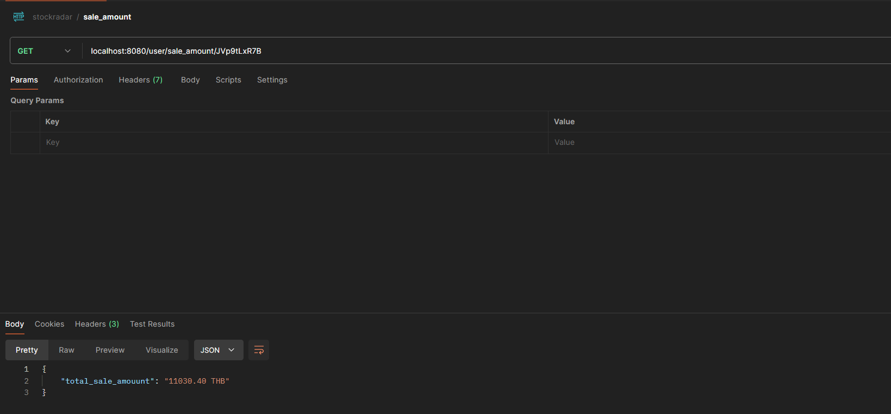
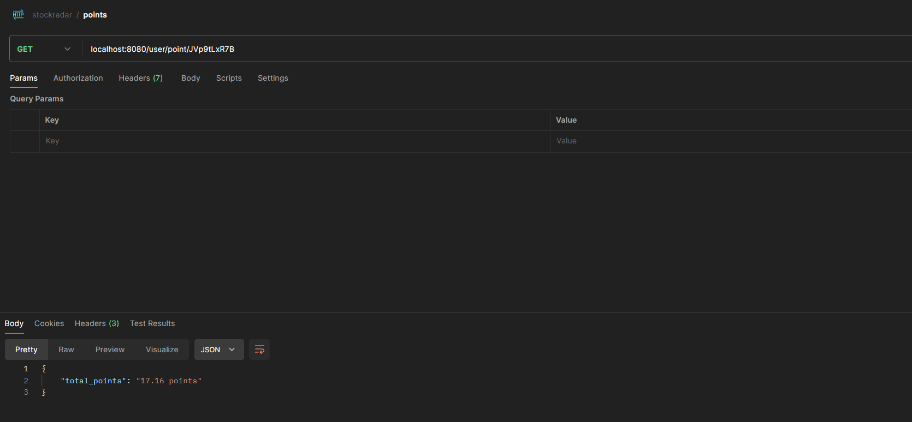

# Stockradar Test

### Prerequisites

* [docker desktop](https://www.docker.com/products/docker-desktop/)
* [golang](https://go.dev/)


### Installing

Please following step by step

if not have goose please install

```
go install github.com/pressly/goose/v3/cmd/goose@latest
```

start db with docker

```
make docker-up
```

start migrations with goose

```
make goose-up
```

start server

```
make server
```

Rollback db

```
make goose-down
```

stop db
```
make docker-down
```

### Example






